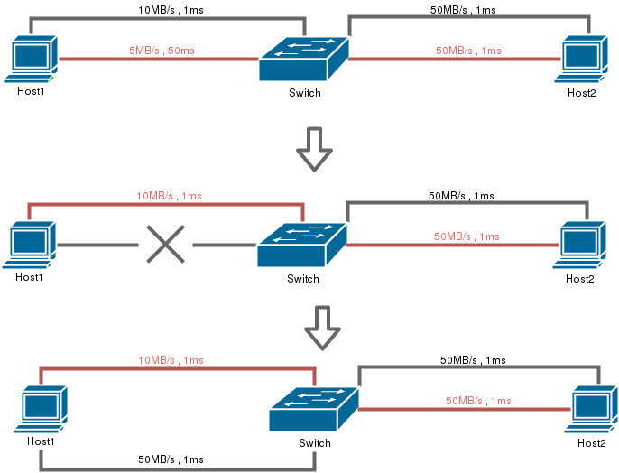

# MultiPath TCP

([They explicitly told me to write this in hungarian](http://alpha.tmit.bme.hu/labor/l02/), sorry about this...)  

#### Témalaboratórium beszámoló

2017\. ősz

Hallgató: Kováts Levente  
Műhely: HSNLab Reliability &amp; Routing  
Műhely vezető: Dr. Tapolcai János  
Téma vezető: Dr. Tapolcai János, Rétvári Gábor  
Feladat: MultiPath TCP beállításainak mérése  

### Kiindulási állapot

- TCP, Net-Routing alap működésének értése (többek között az _Informatika 2_ tantárgyból)
- Linux használata
- python programozási nyelv ismerete

### Felhasznált eszközök

- [AWS EC2](https://aws.amazon.com/ec2/) szerver, MPTCP kernellel
- [mininet](https://github.com/mininet/mininet/): hálózat szimuláló szoftver (linux alapú)
- [iperf](https://iperf.fr/iperf-doc.php): internet sávszélesség méró szoftver
- [tshark](https://www.wireshark.org/docs/man-pages/tshark.html): hálózati adatfolyam analizáló szoftver (~ parancssoros wireshark)
- [plotly](https://plot.ly/): grafikon készítő könyvtár

### A MultiPath TCP megismerése

A MultiPath TCP (továbbiakban MPTCP) alap koncepciójának megismerése részben a laborvezető magyarázatából, részben az [MPTCP weboldalán](http://multipath-tcp.org/) található [leírásokból](http://multipath-tcp.org/data/MultipathTCP-netsys.pdf). Az MPTCP az alap TCP egy kiegészítése. A fő célja, hogy a TCP kapcsolatot biztosabbá tegye az álltal, hogy több kapcsolatot alakít ki a végpontok között. Ezek a kapcsolatok a végpontok különböző interfészei között alakulhatnak ki, így eltérő útvonalakon jöhetnek létre. (Egy forrás-IP, forrás-port, cél-IP, cél-port négyes azonosít egy alkapcsolatot, a négyből legalább az egyik paraméternek el kell térnie egy másik alkapcsolat létrehozásakor.) Ezzel megpróbálja kiküszöbölni az egy útvonal hibája miatt a TCP kapcsolat megszakadását, ilyenkor egy másik útvonalra vált. Tipikus példa erre a mobilkészülékek WiFi és 3G internet elérés közötti átkapcsolása.

Az alap TCP-hez hasonlóan (, azt nem befolyásolva) saját nyugta és sorrend kezeléssel biztosítja a csomagok garantált, sorrend helyes átvitelét, illetve saját ablakozást és torlódás kezelő algoritmust használ az egyensúly tartására az alkapcsolatokon és azok között.

További fő vezérlési elemei: a protokoll támogatásának jelzése a másik végpont felé (MPTCP\_CAPABLE), új alkapcsolat regisztálása (MPTCP\_ADD\_ADDRESS), új alkapcsolat létrehozása (MPTCP\_JOIN\_CONNECTION).

Ezek a hozzáadott kontroll adatok nem módosítják a meglévő TCP protokollt, az opcionális fejléc mezőben kerülnek elhelyezésre. (Így a legvalószínűbb a működőképessége bonyolultabb hálózatokon keresztül is.)

Alkalmazási réteg felől nézve (4. réteg fölöttről) az MPTCP rejtve van, ugyanúgy használható mintha egyszerű TCP kapcsolat lenne (lecseréli a socket api-t egy azonosan használható kiegészítettre).

A protokoll gyakorlati alkalmazása jelenleg adatközpontokban, illetve az Apple készülékein működik (a Siri otthoni aszisztense használja a minél kisebb késleltetés és folyamatos elérhetőség céljából).

### Eszközök előkészítése

#### MPTCP-t támogató környezet létrehozása

Az Apple eszközein alapból támogatott, linuxon egy egyszerű kernell telepítéssel is elérhető (~ apt-get install linux-mptcp). Az MPTCP kernel honlapjáról és egyébb (néha elavúlt) leírásokból lehet különböző egyközökre is [telepíteni](http://multipath-tcp.org/pmwiki.php/Users/AptRepository).

Mininet telepítése git segítségével. (A szoftver használata is jelemzően a forráskódjából érthető meg.) Az iperf és a tshark a mininetel együtt települ fel.

Matplotlib telepítése valamiért nem sikerült, ezért esett a választás a plotly-re (aminek működése viszont online alapú, ezért bizonyos limiteket figyelembe kell venni).

Az MPTCP támogatásának ellenőrzése

A kernell neve utal rá: Linux MPTCP 3.16.0-38-generic (_uname -a_).

Induláskor rendben betöltődött, ezt a log-ból lehet ellenőrizni (_dmesg | grep MPTCP_).

Elérhető beállításainak ellenőrzése (_sysctl net | grep mptcp_).

Aktív MPTCP kapcsolat sikeres létrehozásának ellenőrzése: [tshark-kal analizálva egy kapcsolatot egy MPTCP-t támogató végpont felé](http://www.amiusingmptcp.de/v1/check_connection).

#### Mérési hálózati elrendezés létrehozása

A mérés egy mininetben kialakított hálózati elrendezésben fut. Az MPTCP lényegi működésének vizsgálatához szükséges, hogy a végpontok között különböző útvonalak jöhessenek létre, és ezek különböző paraméterekkel rendelkezzenek (késleltetés és sávszélesség szempontjából).

Két végpontot hoztam létre, amik switch-eken keresztül kapcsolódtak egymáshoz. Először csak az egyik végpont rendelkezett két interfésszel, a másik eggyel. Később az kétirányú kapcsolódás vizsgálata céljából mindkét végpont több interfésszel rendelkezett, amik egy közös switch-en keresztűl érték el egymást.

A több útvonal közötti választás vizsgálata céljából a kapcsolatok különböző paraméterekkel (késleltetés és sávszélesség) rendelkeznek az egyik végpont és a switch között. Az egyik kapcsolat kisebb késleltetéssel (10 ezredmásodperc (továbbiakban ms)) és kisebb sávszélességgel (5 MegaBit/másodperc (továbbiakban MB/s)), a másik kapcsolat nagyobb késleltetéssel (50ms) de nagyobb sávszélességgel (10MB/s) rendelkezett.

#### A mérés elméleti menete

A mérés elsődleges célja az MPTCP ideális beállításának megkeresése a legkisebb késleltetés szempontjából. Természetesen egy olyan esetben, amikor kihasználjuk az MPTCP adta lehetőséget, a TCP kapcsolat megmaradását az egyik útvonal kiesésekor.

Ezt szimulálva, a mérés elején kettő útvonal is elérhető volt a végpontok között, majd a mérés közben azt a kapcsolatot, amin adat átvitel történt lecsatlakoztattam a végpontról. Így megfigyelhető volt az adat átvitel másik útvonalra történő terelése. Később ezek események után egy harmadik, az addigiaknál jobb paraméterrel rendelkező útvonalat is elérhetővé tettem a végpontok között.

A TCP kapcsolat és adatfolyam létrehozásához, valamint a sávszélesség méréséhez az _iperf_ szoftvert használtam. Ez az egyik végponton kiszolgálóként futott amihez a másik végpontról (egy külön ott futó) kapcsolódott hozzá. Ezzel meg lehetett állapítani, hogy a mérés adott időpontjában sikeresen létrejött-e kapcsolat, illetve a mért sávszélességből lehetett arra következtetni, hogy melyik útvonalon történik adatátvitel.

Az MPTCP viselkedésébe mélyebb betekintést engedett a tshark-kal való analizálás, amiből többek között látni lehetett az alkapcsolatok kiépülését.

Az MPTCP viselkedésének vizsgálatához ugyan azt a mérési elrendezést és menetet hajtottam végre a paraméterek különböző beállításával. A három fő beállítást módosítottam: a torlódás vezérlő algoritmust, az útvonal választó algoritmust és az ütemezőt. Ez összesen 60 darab különböző kombinációt eredményezett.

Mivel a különböző beállítások eredménye számokkal megjelenítve nagyon nehezen látható át, az összehasonlítást grafikonos megjelenítéssel próbáltam segíteni. Mivel a mininet python programból volt könnyen vezérelhető, ezért az egyszerűség és gyorsaság miatt a mérés többi részét is python-ban próbáltam megvalósítani. Így a grafikus kirajzoláshoz is ilyen könyvtárat kerestem. Sajnos a népszerű matplotlib könyvtár feltelepítése valamiért nem sikerült, így lett végül a plotly az ehhez használt könyvtár.

### A mérés során megismert problémák

#### Mininet

Mivel ez a program egy hardveres elrendezést próbál szimulálni szoftveresen, néhány funkciója csak bizonyos határokon belül megbízható. A mininet a linux beépített forgalom szabályzóját (tc - traffic control) használja a kapcsolatok a beállított paraméterek szerinti viselkedésének biztosításához.

Jelen esetben az egyik tapasztalt jelenség a nagy kapacitású adatfolyam ingadozó sávszélességet eredményező viselkedése volt. Ez jelentősebben a kapcsolódó ügyfél végpont oldalán jelentkezett. A kapcsolatban sorbanálló csomagok darabszámát (max\_queue\_size) szabályozva, illetve a sávszélességet a kiszolgáló oldalán mérve ez a probléma minimálisra csökkenthető volt. (A végső mérésben a kapcsolatban sorbanálló csomagok darabszámát (max\_queue\_size-t) 100-ra korlátoztam.)

A másik nem várt jelenség a némelyik interfész elérhetetlensége volt. Ha egy végponthoz több interfészt adtam hozzá, akkor bizonyos esetekben valamelyik interfészt nem lehetett elérni a másik végpontról. Természetesen működő kapcsolat volt a kérdéses interfész és a másik végpont között; sőt, az interfészről elérhető volt a másik végpont; sőt, tshark-kal vizsgálva a csomagok megérkeztek az interfészre, de az mégsem érzékelte. Ennek okát nem tudtam kideríteni. A mérés felállítását addig próbálgattam, amíg ez a jelenség nem okozott gondot.

#### Késleltetés mérése

Az iperf szoftver a TCP kapcsolatnak csak a sávszélességét méri, a késleltetését nem. TCP késleltetést mérő programot nem találtam (olyat ami alkalmazás rétegből mér, hogy az MPTCP zavartalanul működhessen közben, hiszen azt mérjük). Egy ilyen mérő program megírása nem tűnt bonyolult feladatnak, ezért nekiláttam írni egyet. Az első elképzelés az volt, hogy elárasztom a kapcsolatot átviendő adattal, és mérem, hogy mennyi adatot sikerül átvinni, illetve mennyi idő telik el a küldés és a fogadás között. A küldendő adat az aktuális időbélyeg volt, így a fogadó tudta a küldés és a fogadás időpontját, és meg tudta határozni a késleltetést. Ez akkor működött, ha a két végpont órája ezredmásodpercre egyezett. Abban az esetben ha ez nem biztosítható, a fogadott időbélyeg visszaküldésével az eredeti küldő visszakapta a csomagot ami tartalmazta az elküldés idejét, így meg tudta határozni a körülfordulási időt (rtt). A probléma az volt, hogy a kapcsolat elárasztásával rövid idő után nagy mennyiségű csomag várakozott a küldendő sorban, és így egy csomag késleltetése nagyságrendekkel nagyobb volt a valóságban a kapcsolaton eltöltött idejénél. Ennek elkerülésére külön mértem a sávszélességet (elárasztással), és külön a késleltetést, utóbbit oly módon, hogy a következő csomagot csak akkor küldte el, amikor az előző visszaérkezett (ping-pong), így nem alakult ki várakozó sor. (Lehet hogy az ablak szélesség kicsire állításával is megoldható lett volna. A kernel számontartja a körülfordulási időt az egyes kapcsolatokon, onnan is ki lehetne olvasni (például az ss paranccsal). Ezekre most nem volt idő.) A végleges mérésben végül nem szerepelt a késleltetés mérése, mivel a tapasztalatom szerint nem befolyásolta az MPTCP működését. Így a végső mérésben az iperf-et használtam.

#### MPTCP útvonal választása

A várt viselkedés az lett volna, hogy az MPTCP algoritmusa feltérképezi a végpontok között kialakítható útvonalakat, és az adatfolyamot a legkisebb késleltetéssel rendelkező kapcsolatra tereli, esetleg egyszerre több útvonalon is végez adat továbbítást.

Nagy nehézséget jelentett, hogy nem találtam működő példa kódot, ami megmutatta volna az MPTCP viselkedését. (Van egy példa kód, de az már néhány éves, azóta válltoztak a beállítások, így az eredetileg hibát dob, módosítva sem nem sikerült a várt eredményt kihozni belőle.).

Ezzel szemben a tapasztalat egyértelműen azt mutatta, hogy az MPTCP semennyire nem veszi figyelembe sem a késleltetést, sem a sávszélességet. Bármelyik beállítással mértem, az algoritmus az adatfolyamhoz mindig az egyik kapcsolatot választotta ki, függetlenül attól, hogy a többi kapcsolatnak jobbak vagy rosszabbak voltak a paraméterei. Például a 100ms késleltetésű és 5MB/s sávszélességű kapcsolatot választotta, pedig mellette létezett egy 10ms késleltetésű és 20MB/s sávszélességű kapcsolat is. Holott az elérhető útvonalak mindegyikén felépített egy kapcsolatot (, ez a tshark-os analizálásból egyértelműen látszott), tehát a lehetősége meg lett volna rá.

Ez nem válltozott az új útvonal hozzáadásánál sem. Hiába hoztam létre egy újabb útvonalat (és adtam a végponthoz egy újabb interfészt, ami ehhez kapcsolódott), az algoritmus kiépítette a kapcsolatot az új útvonalon is, de nem küldött rajta adatot, függetlenül attól, hogy jobbak voltak a paraméterei a meglévő útvonal(ak)énál.

Ha az adatátvitelre használt kapcsolat megszakadt, bizonyos beállításokkor (full-mesh) sikerült átválltania egy másik, működő kapcsolatra. Kivéve ha már egy ideje az éppen megszakadt kapcsolatot használta. Tapasztalatom szerint ugyanis, ha már körülbelül fél perce használt egy kapcsolatot, akkor a kapcsolat megszakadásakor nem váltott át egy másik, működő kapcsolatra, hanem az egész adatátvitel leállt; míg ha csak fél percnél rövidebb ideje használta a kapcsolatot, úgy képes volt egy másik, működő kapcsolatra váltani. A jelenségnek nem tudom az okát.

### A mérés eredménye

Miután kitapasztaltam, hogy a mérés milyen elrendezés és időzítés esetén fog működni, lefuttattam a beállítások összes kombinációjára, hogy látható legyen az egyes paramétereknek az MPTCP viselkedésére gyakorolt hatása. A végső elrendezés kiindulási állapota két végpont volt, két-két interfésszel, amik egy közös switch-csel kapcsolódtak egymáshoz. Az egyik (,az MPTCP álltal először választott) útvonalon 50ms késleltetés és 5MB/s sávszélesség volt beállítva, a másik útvonalon 1ms késleltetés és 10MB/s sávszélesség volt. Az egész mérés 24 másodpercig tartott, az idő egyharmadánál (8s) lekapcsoltam az adatátvitelre használt útvonalat, az idő kétharmadánál (16s) pedig hozzáadtam egy új útvonalat, ami az eddigieknél jobb paraméterekkel, 1ms késleltetéssel és 50MB/s sávszélességgel rendelkezett.

Mivel a beállítások mind a 60 kombinációját össze akartam hasonlítani, az egyes eredményeket grafikonra külön-külön kirajzolva, majd az összeset a beállítások szerint táblázatba rendezve és egyszerre (egymás mellett) megjelenítve tudtam értékelni a főbb viselkedési jellemzőket.

Elsőre lehet hogy nehéz értelmezni a 60 grafikont együtt, az ábrák láthatósága az eszköz felbontásától is nagyban függ (kivetítőn vagy telefonon próbálkozunk...), így először egyet érdemes külön megnézni:

_1. ábra_: egyetlen mérés eredménye

Az _1. ábrán_ az látszik, hogy először az MPTCP 5MB/s sávszélességű kapcsolatot használja, majd amikor ez  az útvonal megszakad, akkor kis késéssel átvált a másik, 10MB/s sávszélességű kapcsolatra. A harmadik kapcsolat becsatlakozása nincs semmilyen hatással.

_2. ábra_: összesített eredmény

(érdemesebb belenagyítva is vizsgálni)

##### Az összesített ábra elemzése

A _2. ábrán_ látszik, hogy a kapcsolatok közötti válltás csak a _full-mesh_ útvonalválasztó algoritmussal (_path-manager_) valósult meg. A _default_ útvonalválasztó algoritmus az alap TCP-t jelenti, itt nem is vártunk átkapcsolást. Az _ndiffports_ ugyanazon ip címek között, de különböző portszámokkal hozna létre kapcsolatokat (ez most igazából ki volt kapcsolva). A _binder_ elvileg figyelembe venné a késleltetést, most nem sikerült működésre bírnom.

A torlódás szabályzó (_congestion control_) algoritmusok közül csak a _wvegas_ használata mutat eltérést a többitől; ez a leírása alapján a késleltetést figyelembe véve szabályoz, itt ingadozóbb adatsebességet és valamennyivel kisebb sávszélesseget eredményezett.

Az ütemezők (_scheduler_) közül a _default_ kiegyensúlyozott eredményt mutatott. A _roundrobin_ elvileg felválta irányította volna a csomagokat a kapcsolatok között, de ez a működése egyáltalán nem mutatkozott, ugyanúgy viselkedett, mint a _default_. A _redundant_ algoritmus viselkedése egyértelműen látható eredmény mutatott; a kapcsolatot jóval ingadozóbbá tette és kisebb sávszélességet produkált.

## Tanulságok

### Mininet

Egy hardvert szimuláló szoftvernek természetesen vannak korlátai. Komolyabb mérést célszerű tényleges fizikai eszközökön végezni; főleg, ha lényegesen számítanak azok a paraméterek, amiket a szoftver csak korlátozottan tud megvalósítani.

#### Késleltetés mérés

A TCP késleltetésének méréséhez ki kell küszöbölni a sorbanállás okozta időveszteséget; vagy tudni kell, hogy ez akár nagyságrendekkel többet számít, mint a csomag a tényleges útvonalon haladásának ideje.

#### MPTCP

A késleltetés figyelembe vételét a kapcsolat kiválasztásánál sajnos sehogy sem sikerült elérni. Próbálkoztam több elrendezéssel, szabályozással, időzítéssel, de sehogy sem ment. Nagy nehézség, hogy igazából nincs hozzá elérhető, működő példa, ami ezt megmutatná. (Lehetséges hogy a kernel nem jó, vagy nem jól van beállítva. Meg lehetne próbálni saját kernelt fordítani, a forráskódja és az ehhez szükséges intrukciók elvileg elérhetőek; de erre most nem volt idő.)

Az összesített elemzésből az következik (amit az MPTCP kernel honlapján is erősen javasolnak), hogy az alap beállításokkal célszerű az MPTCP használni. Ezek az útvonalválasztóra (_path-manager_) a _full-mesh_; a torlódás szabályzóra (_congestion control_) a _default_; és az ütemezőre (_scheduler_) is a _default_ beállítás.

Hivatkozások

[1]: MPTCP kernel projekt: [https://multipath-tcp.org/](https://multipath-tcp.org/)

[2]: MPTCP működése nagyvonalakban: [http://multipath-tcp.org/data/MultipathTCP-netsys.pdf](http://multipath-tcp.org/data/MultipathTCP-netsys.pdf)

[3]: MPTCP kernel telepítése: [http://multipath-tcp.org/pmwiki.php/Users/AptRepository](http://multipath-tcp.org/pmwiki.php/Users/AptRepository)

[4]: MPTCP támogatásának ellenőrzése: [http://www.amiusingmptcp.de/v1/check\_connection](http://www.amiusingmptcp.de:8080/v1/check_connection)

[5]: AWS EC2: [https://aws.amazon.com/ec2/](https://aws.amazon.com/ec2/)

[6]: Mininet: [https://github.com/mininet/mininet/](https://github.com/mininet/mininet/)

[7]: Iperf: [https://iperf.fr/iperf-doc.php](https://iperf.fr/iperf-doc.php)

[8]: Tshark: [https://www.wireshark.org/docs/man-pages/tshark.html](https://www.wireshark.org/docs/man-pages/tshark.html)

[9]: Plotly: [https://plot.ly/](https://plot.ly/)

[10]: Témalaboratórium: [http://alpha.tmit.bme.hu/labor/l02/](http://alpha.tmit.bme.hu/labor/l02/)

[11]: Nagyfelbontású összesített eredmény: [https://image.ibb.co/mWgsXw/all\_color\_descr.png](https://image.ibb.co/mWgsXw/all_color_descr.png)

[12]: A mérés forráskódja: [https://gist.github.com/tovask/316f0dc855f2459042af403688590a7f](https://gist.github.com/tovask/316f0dc855f2459042af403688590a7f)
